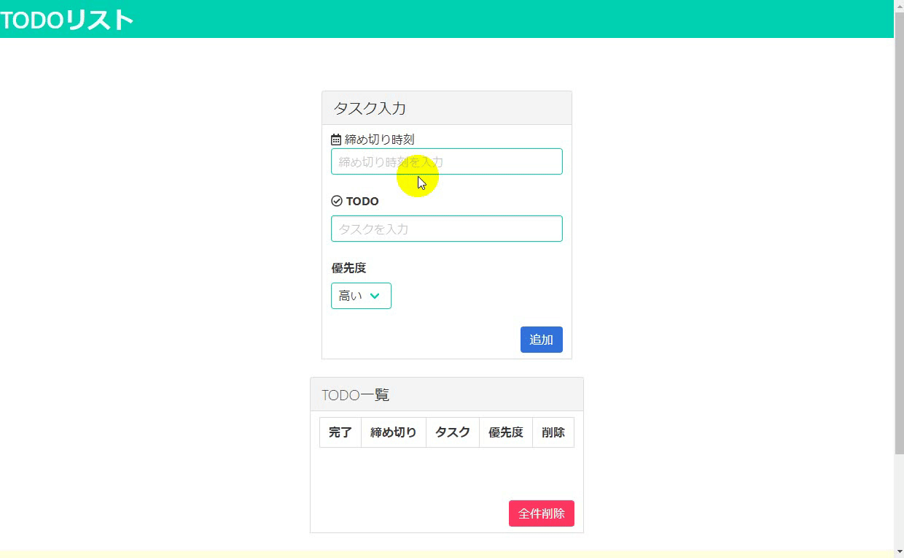

# TODO list made by Pure JS

## Description

A simple TODO list made with Pure JS.  
You can enter and register tasks, deadlines and priorities.  
The entered task is saved in IndexedDB, but it disappears when reloading.

***DEMO:***

## Library list used

- [bluma](https://bulma.io/)
- [Bulma Modal FX](https://postare.github.io/bulma-modal-fx/)
- [Font Awesome](https://fontawesome.com/)
- [flatpickr](https://flatpickr.js.org/)
- [Dexie.js](https://dexie.org/)

## Tested browser

### Mac

- Safari
- GoogleChorome
  
### windows

- GoogleChorome
- Edge
- FireFox

*IE 11* is not supported.

## to-do list

- Try Firebase
- Try rewriting with the framework of jQuery and Bootstrap 4, or Vue.js party

## Author 
[Daichi Yoshida](https://github.com/dy0110)  

日本語版は[こちら](/doc/ja/README.ja.md)